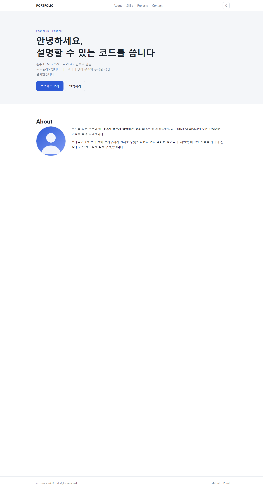
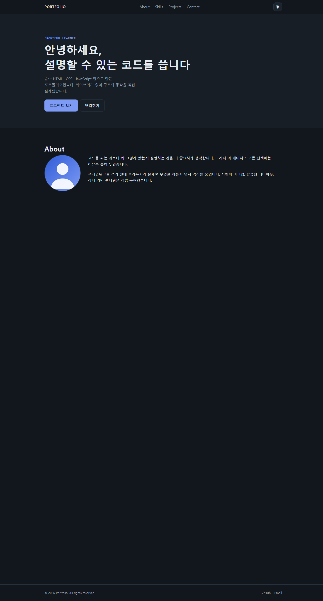
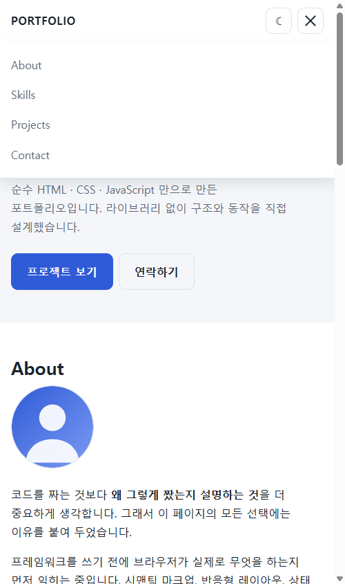
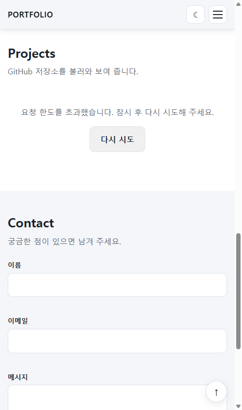

# 나를 소개하는 웹페이지 (B1-1)

순수 HTML · CSS · JavaScript 만으로 만든 반응형 포트폴리오 웹사이트입니다.
프레임워크와 라이브러리를 일절 쓰지 않고, 시맨틱 마크업 · 반응형 레이아웃 ·
상태 기반 렌더링 · 비동기 API 연동 · 폼 유효성 검사를 직접 구현했습니다.

| 항목 | 값 |
|---|---|
| **배포 URL** | https://mylovelycatmori.github.io/Marina2nd_Codyssey/phase2-ai-tools/b1-1-portfolio/ |
| **저장소** | https://github.com/MylovelyCatMori/Marina2nd_Codyssey |
| **소스 경로** | `phase2-ai-tools/b1-1-portfolio/` |
| **사용 기술** | HTML5, CSS3, JavaScript (ES6+), GitHub REST API, GitHub Pages |
| **외부 의존성** | **없음** (라이브러리 0, 웹폰트 0, 아이콘 패키지 0) |

---

## 1. 프로젝트 개요

방문자가 한 화면에서 **내가 누구인지 → 무엇을 할 줄 아는지 → 무엇을 만들었는지 →
어떻게 연락하는지** 순서로 훑을 수 있는 1페이지 포트폴리오입니다.

Projects 섹션은 하드코딩된 목록이 아니라 **GitHub REST API로 실시간 조회**합니다.
저장소를 새로 만들면 페이지를 고치지 않아도 자동으로 반영됩니다. 대신 네트워크를
타는 만큼 로딩 · 성공 · 실패 · 빈 상태 네 가지를 모두 화면으로 표현해야 했고,
이 부분이 이 프로젝트의 핵심입니다.

---

## 2. 주제 선정 이유

과제가 지정한 주제(자기소개 웹페이지)를 그대로 따랐습니다. 다만 **Projects 섹션을
API 연동으로 구현**하는 쪽을 선택했습니다. 더미 데이터를 배열로 박아두면 화면은
똑같이 나오지만, 그러면 이 과제에서 배울 것이 사라집니다.

- 하드코딩: 데이터가 항상 즉시 존재한다. 실패할 일이 없다.
- API 연동: 데이터가 **나중에** 온다. 안 올 수도 있다. 와도 비어 있을 수 있다.

"데이터가 아직 없는 시간"을 화면으로 다루는 법을 배우는 것이 목적이었습니다.

---

## 3. 실행 방법

### 배포본 보기

별도 설치 없이 아래 주소로 접속합니다.

```
https://mylovelycatmori.github.io/Marina2nd_Codyssey/phase2-ai-tools/b1-1-portfolio/
```

### 로컬에서 실행

```bash
git clone https://github.com/MylovelyCatMori/Marina2nd_Codyssey.git
cd Marina2nd_Codyssey/phase2-ai-tools/b1-1-portfolio
```

이후 VS Code에서 폴더를 열고 **Live Server** 확장의 `Go Live`를 누릅니다.
기본 주소는 `http://127.0.0.1:5500` 입니다.

> **`index.html`을 파일 탐색기에서 직접 더블클릭해도 열리지만 권장하지 않습니다.**
> 그 경우 주소가 `file://`이 되는데, 브라우저는 `file://`을 매번 다른 출처로 취급해
> 일부 기능(특히 저장소 접근)에서 예상과 다르게 동작할 수 있습니다.
> Live Server는 `http://`로 띄워주므로 배포 환경과 조건이 같아집니다.

### 필요 환경

| 항목 | 요구사항 |
|---|---|
| 브라우저 | 최신 Chrome (개발·검증 기준) |
| 에디터 | VS Code + Live Server 확장 |
| 런타임 | **없음.** Node.js, 빌드 도구, 패키지 설치가 전부 불필요합니다 |

---

## 4. 기능 목록

### 4-1. 레이아웃 · 스타일

| 기능 | 구현 | 위치 |
|---|---|---|
| 시맨틱 마크업 | `header` `nav` `main` `section` `article` `footer` | `index.html` |
| CSS 변수 | `:root`에 색 · 글꼴 · 간격 정의 | `css/style.css` §1 |
| 다크 모드 변수 | `[data-theme="dark"]`에 색만 재정의 | `css/style.css` §1 |
| Flexbox | 네비게이션 (로고 좌 / 메뉴 우) | `css/style.css` §3 |
| Grid | Projects 카드 `repeat(auto-fit, minmax(260px, 1fr))` | `css/style.css` §8 |
| 모바일 퍼스트 | 기본 규칙이 좁은 화면, `min-width`로만 확장 | `css/style.css` 전체 |
| 브레이크포인트 | 768px(태블릿) / 1024px(데스크톱) | `css/style.css` §12 |
| 햄버거 메뉴 | 모바일에서 메뉴 숨김 + 버튼 표시 | `css/style.css` §3 |
| hover · transition · box-shadow | 버튼 · 카드 | `css/style.css` §4, §8 |

### 4-2. 인터랙션

| 기능 | 임계값 | 위치 |
|---|---|---|
| 햄버거 메뉴 토글 | - | `js/main.js` |
| 부드러운 스크롤 | - | `js/main.js` |
| 스크롤탑 버튼 표시 | **300px** | `SCROLL_TOP_THRESHOLD` |
| 네비 배경 변경 | **60px** | `NAV_SCROLL_THRESHOLD` |
| 스크롤 등장 애니메이션 | **0.2** (20% 노출) | `OBSERVER_THRESHOLD` |
| 다크 모드 토글 + 저장 | - | `localStorage.theme` |

> **임계값 3종은 전부 `js/main.js` 최상단에 상수로 모아두었습니다.**
> 코드 중간에 `300`이라는 숫자가 튀어나오면, 반년 뒤의 내가 그 숫자가 무엇인지
> 알 수 없습니다.

### 4-3. 데이터 · 폼

| 기능 | 구현 |
|---|---|
| GitHub 저장소 조회 | `fetch` + `async/await` |
| 4상태 렌더링 | 로딩 / 성공 / 에러+재시도 / 빈 상태 |
| 언어별 필터링 (보너스) | `filter`, `language`가 없으면 `Unknown`으로 분류 |
| 폼 필수값 검증 | `trim()` 후 빈 값 차단 |
| 폼 이메일 형식 검증 | 정규식, **빈 값 검사를 먼저** |
| 입력 중 에러 해제 | `input` 이벤트 |
| Hero 타이핑 효과 (보너스) | `setTimeout` 재귀, 3문장 순환 |

---

## 5. 파일 구조

```
b1-1-portfolio/
├── index.html              # 문서 구조 전체. 시맨틱 태그로만 구성
├── css/
│   └── style.css           # 스타일 전부. 13개 구역으로 나누어 주석 표시
├── js/
│   └── main.js             # 동작 전부. 상수 → 상태 → 요소 → 렌더 → 이벤트 순
├── images/
│   ├── profile.svg         # About 프로필 이미지 (외부 의존 없이 직접 작성)
│   ├── favicon.svg         # 탭 아이콘. 없으면 /favicon.ico 404가 남는다
│   └── screenshots/        # README용 실행 화면
├── PRD/                    # 설계 문서 4종 (구현 전 작성)
├── REQUIREMENTS.md         # 과제 요구사항 전수 추적표 (86개)
├── TODO.md                 # 단계별 작업 기록
└── README.md               # 이 문서
```

**폴더를 역할별로 나눈 이유**는 파일이 늘어날 때 찾는 비용을 일정하게 유지하기
위해서입니다. 지금은 파일이 세 개뿐이라 한 폴더에 둬도 불편하지 않지만, 그때
옮기려면 모든 경로를 고쳐야 합니다.

---

## 6. 데이터와 설정

### 6-1. GitHub API

| 항목 | 값 |
|---|---|
| 엔드포인트 | `https://api.github.com/users/MylovelyCatMori/repos` |
| 쿼리 | `?sort=updated&per_page=100` |
| 인증 | 없음 (공개 데이터) |
| 요청 한도 | 인증 없이 **시간당 60회**. 초과 시 403 |

사용하는 필드는 다섯 개입니다.

| 필드 | 용도 | null 가능 |
|---|---|---|
| `name` | 카드 제목 | 아니오 |
| `description` | 카드 설명 | **예** → "설명이 없는 저장소입니다." |
| `language` | 언어 칩 · 필터 기준 | **예** → `Unknown` |
| `stargazers_count` | 별 개수 | 아니오 |
| `html_url` | 카드 링크 | 아니오 |

> `description`과 `language`는 GitHub가 **`null`을 그대로 돌려줍니다.**
> 아무 처리도 하지 않으면 화면에 `null`이라는 글자가 그대로 찍힙니다.

### 6-2. localStorage

| 키 | 값 | 없을 때 |
|---|---|---|
| `theme` | `'light'` 또는 `'dark'` | 시스템 설정(`prefers-color-scheme`)을 따름 |

테마 결정 우선순위: **① 저장된 값 → ② 시스템 설정 → ③ 라이트**

### 6-3. 인코딩

모든 파일은 **UTF-8**입니다. `index.html`의 `<meta charset="UTF-8">`은
`<head>`의 첫 줄에 있습니다. 이 줄이 늦게 나오면 그 전까지 읽은 한글이 깨집니다.

---

## 7. 코드 구조와 설계 의도

### 7-1. `js/main.js`의 5단 구성

```
1. 상수       임계값 3종, API 주소, 저장소 키
2. AppState   화면을 결정하는 모든 값
3. 요소 참조   querySelector 결과를 한 번만 담아둔다
4. 렌더 함수   상태를 읽어 화면에 반영한다
5. 이벤트     상태를 바꾸고 렌더 함수를 부른다
```

**핵심 원칙은 단방향입니다.**

```
이벤트  →  AppState 변경  →  렌더 함수  →  화면
```

이벤트 처리기가 화면을 **직접 고치지 않습니다.** 상태만 바꾸고 렌더 함수를
부릅니다. 이렇게 하면 "지금 화면이 왜 이렇게 보이는가"의 답이 항상 `AppState`
한 곳에 있습니다.

### 7-2. 왜 상태를 한 객체에 모았는가

값을 전역 변수로 흩어놓으면 화면과 값이 어긋났을 때 어디를 봐야 할지 알 수
없습니다. `AppState` 하나만 열어보면 현재 화면의 근거가 전부 보입니다.

| 필드 | 담당 |
|---|---|
| `theme` | 라이트/다크 |
| `repoState` | 저장소 취득 과정 전체 (`status` / `data` / `error`) |
| `activeLanguage` | 선택된 언어 필터 |
| `formValues` / `formErrors` / `formSuccess` | 폼 |
| `uiState` | 메뉴 열림 · 스크롤 파생값 |

### 7-3. 왜 `status` 문자열 하나인가

`isLoading`, `isError`, `isEmpty` 같은 boolean 세 개를 쓰면 조합이 **8가지**가
됩니다. 그런데 실제로 존재할 수 있는 상태는 **4가지**뿐입니다.

"로딩 중이면서 동시에 에러"라는 불가능한 상태가 **코드상 표현 가능해지는 순간**,
언젠가 그 버그가 납니다. 문자열 하나면 애초에 4가지 외에는 만들 수 없습니다.

### 7-4. 왜 `renderProjects()`가 하나인가

상태마다 `showLoading()`, `hideLoading()`, `showError()`를 따로 두면 "로딩을
숨기는 것을 깜빡한" 조합이 생깁니다. **한 함수가 `innerHTML`을 통째로 덮어쓰면**
그런 조합 자체가 불가능합니다.

### 7-5. 왜 필터에 `filter`와 `slice`만 쓰는가

`splice`나 `sort`는 **원본 배열을 직접 바꿉니다.** 한 번 걸러낸 항목이 원본에서
사라지므로 "전체" 버튼을 눌러도 돌아오지 않습니다. `filter`와 `slice`는 **새 배열을
돌려주므로** `repoState.data`가 언제나 처음 받은 그대로 남습니다.

### 7-6. 왜 재시도 버튼에 이벤트를 위임했는가

재시도 버튼은 화면을 다시 그릴 때마다 **새로 만들어집니다.** 버튼에 직접 리스너를
달면 다시 그려지는 순간 사라집니다. 그래서 사라지지 않는 부모(`#projects-grid`)에
한 번만 답니다. 언어 필터 버튼도 같은 이유로 위임했습니다.

### 7-7. `css/style.css`의 13구역

`0. 기본 정리` → `1. 변수` → `2. 뼈대` → `3. 헤더` → `4. 버튼` → `5~10. 섹션별`
→ `11. 애니메이션` → `12. 브레이크포인트` → `13. 접근성`

**브레이크포인트를 맨 끝에 모은 이유**는 "넓어졌을 때만 적용되는 규칙"이 한곳에
있어야 반응형 동작을 한눈에 확인할 수 있기 때문입니다. 각 컴포넌트 밑에 흩어놓으면
768px에서 무엇이 바뀌는지 알려면 파일 전체를 훑어야 합니다.

---

## 8. 핵심 개념 정리

> 과제 목표에서 "설명할 수 있어야 한다"고 명시한 6개 항목입니다.

### G-01. 시맨틱 태그를 왜 쓰는가

`div`는 "여기 무언가 있다"는 뜻밖에 없습니다. 시맨틱 태그는 **그 무언가가
무엇인지**까지 알려줍니다.

- **화면 낭독기**가 "탐색 영역", "본문"으로 안내할 수 있습니다.
- **검색엔진**이 문서의 주제와 구조를 파악합니다.
- **사람**이 코드를 열었을 때 클래스 이름을 읽지 않아도 구조가 보입니다.

구조 설계 기준은 **"이 블록을 한 단어로 부른다면?"** 이었습니다. 페이지 맨 위 =
`header`, 그 안의 링크 묶음 = `nav`, 본문 = `main`, 주제별 덩어리 = `section`,
**그 자체로 독립해서 의미가 서는 것** = `article`.

Projects 카드를 `article`로 쓴 이유가 여기 있습니다. 카드 하나를 잘라 다른 곳에
붙여도 "저장소 하나의 소개"로 읽힙니다.

### G-02. Flexbox와 Grid의 차이, 선택 기준

| | Flexbox | Grid |
|---|---|---|
| 차원 | **1차원** (한 줄) | **2차원** (행과 열) |
| 크기 결정 | 내용물이 정한다 | 컨테이너가 정한다 |
| 적합한 상황 | 개수가 적고 크기가 제각각 | 개수가 많고 크기가 같음 |

**세 문장 요약**

1. 네비게이션에는 Flexbox를 썼습니다. 로고와 메뉴가 **한 줄에 나란히** 놓이고,
   각 항목의 폭이 글자 길이에 따라 제각각이기 때문입니다.
2. Projects 카드에는 Grid를 썼습니다. 카드가 **여러 줄로 접히고**, 모든 칸이
   같은 폭이어야 하기 때문입니다.
3. Grid를 쓴 덕분에 `repeat(auto-fit, minmax(260px, 1fr))` 한 줄로 화면 폭에 따라
   칸 수가 자동으로 바뀌어, Projects 섹션에는 미디어 쿼리가 **한 줄도 없습니다.**

### G-03. `querySelector` → `addEventListener` 흐름

```js
const button = document.querySelector('#theme-toggle');   // ① 찾는다
button.addEventListener('click', () => {                   // ② 기다린다
  AppState.theme = AppState.theme === 'dark' ? 'light' : 'dark';  // ③ 바꾼다
  renderTheme();                                           // ④ 그린다
});
```

`querySelector`는 CSS 선택자로 요소를 **하나** 찾습니다. 못 찾으면 에러가 아니라
`null`을 돌려줍니다. 그래서 `null`인 줄 모르고 쓰면 엉뚱한 줄에서 에러가 납니다.

`addEventListener`는 "이 일이 일어나면 이 함수를 불러라"를 등록합니다.
HTML의 `onclick` 속성과 달리 **같은 이벤트에 여러 함수를 달 수 있고**, 구조(HTML)와
동작(JS)이 섞이지 않습니다.

### G-04. 화살표 함수 · 구조분해 할당 · 배열 메서드

**화살표 함수** — 짧게 쓰기 위해서만 있는 문법이 아닙니다. 콜백으로 넘길 함수에
이름을 붙일 필요가 없을 때, 그 자리에서 바로 적을 수 있습니다.

```js
els.navLinks.forEach((link) => { /* ... */ });
```

**구조분해 할당** — 객체에서 필요한 값만 꺼냅니다.

```js
const { name, description, language, stargazers_count: stars, html_url: url } = repo;
```

`repo.name`, `repo.description`을 매번 쓰는 대신 한 줄로 끝납니다. `:`를 쓰면
이름도 바꿔 받을 수 있어, 길고 읽기 나쁜 필드명을 코드 안에서 짧게 쓸 수 있습니다.

**배열 메서드** — `for` 반복문과 달리 **무엇을 하려는지가 이름에 드러납니다.**

| 메서드 | 뜻 | 이 프로젝트에서 |
|---|---|---|
| `map` | 모양을 바꾼다 | 저장소 객체 → 카드 HTML 문자열 |
| `filter` | 골라낸다 | 선택한 언어의 저장소만 |
| `forEach` | 하나씩 처리한다 | 폼 필드 3개 검증 |

셋 다 **원본을 바꾸지 않고 새 값을 돌려준다**는 점이 중요합니다.

### G-05. `fetch` + `async/await`와 4상태 UI

```js
const fetchRepos = async () => {
  AppState.repoState = { status: 'loading', data: [], error: null };
  renderProjectsSection();                       // ① 로딩 화면을 먼저 그린다

  try {
    const response = await fetch(GITHUB_REPOS_URL);
    if (!response.ok) {                          // ② 상태 코드를 직접 확인
      throw new UserFacingError(describeHttpError(response.status));
    }
    const repos = await response.json();
    AppState.repoState = {
      status: repos.length > 0 ? 'success' : 'empty',   // ③ 0개는 실패가 아니다
      data: repos, error: null
    };
  } catch (error) { /* ... */ }

  renderProjectsSection();                       // ④ 마지막에 한 번만 그린다
};
```

**함정 세 가지를 짚었습니다.**

1. **`await`이 없으면** 응답 대신 `Promise` 객체 자체가 담깁니다. `async` 함수는
   항상 `Promise`를 돌려주고, `await`은 "그 안의 값이 나올 때까지 기다려라"입니다.
2. **`fetch`는 404나 403에 예외를 던지지 않습니다.** "서버에 닿았다"는 것 자체는
   성공으로 보기 때문입니다. `response.ok`를 직접 확인해야 합니다.
3. **로딩 상태를 응답 후에 바꾸면** 로딩 화면이 한 번도 보이지 않습니다.

**4상태가 화면에서 어떻게 다른가**

| status | 화면 | 재시도 버튼 |
|---|---|---|
| `loading` | "프로젝트를 불러오는 중입니다..." | 없음 |
| `success` | 카드 목록 + 언어 필터 | 없음 |
| `error` | 상황별 문구 | **있음** |
| `empty` | "표시할 프로젝트가 없습니다." | **없음** |

`empty`에 재시도 버튼을 두지 않은 이유는, 저장소가 0개인 것은 **실패가 아니기**
때문입니다. 다시 눌러도 영원히 0개입니다. 사용자를 헛수고시키게 됩니다.

### G-06. 이벤트 → 상태 → DOM 업데이트

이 프로젝트에는 같은 모양의 흐름이 **4개** 있습니다.

| # | 이벤트 | 상태 변경 | 화면 반영 |
|---|---|---|---|
| 1 | 토글 버튼 `click` | `AppState.theme` | `<html data-theme>` → CSS 변수 세트 전환 |
| 2 | `fetch` 완료 | `repoState.status` | `renderProjects()` 4갈래 분기 |
| 3 | `submit` / `input` | `formErrors` | 필드별 에러 문구 표시·해제 |
| 4 | 필터 버튼 `click` | `activeLanguage` | 카드 목록 재구성 |

**흐름 1을 예로 들면**, 토글을 눌러도 JavaScript는 색을 **하나도 지정하지
않습니다.** `<html>`에 `data-theme="dark"` 속성 하나를 붙일 뿐입니다. 그러면 CSS의
`[data-theme="dark"]` 규칙이 켜지면서 변수 세트가 통째로 갈립니다.

색을 JS에서 지정했다면 나중에 색 하나를 바꿀 때 CSS와 JS **두 곳**을 고쳐야 합니다.

---

## 9. 예외 · 에러 처리

| 상황 | 처리 | 위치 |
|---|---|---|
| API 요청 한도 초과 (403) | "요청 한도를 초과했습니다. 잠시 후 다시 시도해 주세요." + 재시도 | `describeHttpError()` |
| 사용자 없음 (404) | "해당 GitHub 사용자를 찾을 수 없습니다." + 재시도 | `describeHttpError()` |
| 네트워크 끊김 | "네트워크에 연결되어 있지 않습니다." + 재시도 | `fetchRepos()` `catch` |
| 그 외 실패 | "프로젝트를 불러올 수 없습니다. 연결 상태를 확인해 주세요." | `fetchRepos()` `catch` |
| 저장소 0개 | "표시할 프로젝트가 없습니다." (에러 아님) | `renderProjects()` |
| 필터 결과 0개 | "○○ 프로젝트가 없습니다." | `renderProjects()` |
| `description` / `language`가 `null` | 기본 문구 · `Unknown`으로 대체 | `createCard()` |
| 저장소 이름·설명에 HTML 태그 | `escapeHtml()`로 무력화 | `createCard()` |
| `localStorage` 접근 차단 | `try/catch`로 감싸고 경고만 남김 | `storage` 래퍼 |
| 폼 빈 값 / 공백만 입력 | `trim()` 후 차단 + 첫 문제 칸으로 포커스 | `validateField()` |
| 폼 이메일 형식 오류 | 형식 안내 문구 (빈 값 검사 **이후**) | `validateField()` |
| 움직임 최소화 설정 | 전환·타이핑·스크롤 애니메이션 비활성 | `prefers-reduced-motion` |
| JavaScript 비활성 | 등장 애니메이션 클래스를 JS가 붙이므로 본문은 그대로 보임 | `setupReveal()` |

### 특히 신경 쓴 두 가지

**① 개발자용 문구가 화면에 새어 나가지 않게**

`fetch`가 네트워크 문제로 던지는 에러의 `message`는 `"Failed to fetch"`입니다.
이것을 그대로 보여주면 사용자는 무엇을 해야 할지 알 수 없습니다.
`UserFacingError` 클래스를 만들어 **우리가 직접 던진 문구만** 화면에 내보내고,
원본 에러는 `console.error`로 콘솔에만 남깁니다.

**② 외부에서 받은 문자열을 HTML에 넣기 전에**

저장소 이름에 ``가 들어 있으면 `innerHTML`에 넣는 순간
실행됩니다. `escapeHtml()`이 꺾쇠와 따옴표를 무력화해 **글자로만** 표시되도록
했습니다. 실제로 이 값을 넣어 테스트했고 실행되지 않는 것을 확인했습니다.

---

## 10. 실행 화면

### 데스크톱 (라이트)



### 데스크톱 (다크)



### 모바일 (햄버거 메뉴 펼침)



### 에러 상태 (403 요청 한도 초과)



> 에러 화면은 실제로 재현하기 어려우므로, 개발자도구에서 응답을 403으로 바꿔
> 캡처했습니다.

---

## 11. 개발 환경

| 항목 | 값 |
|---|---|
| OS | Windows 11 |
| 에디터 | VS Code |
| 확장 | Live Server |
| 브라우저 | Chrome (최신) |
| 빌드 도구 | **없음** |
| 패키지 매니저 | **없음** |

`node_modules`도, `package.json`도 없습니다. 파일을 열면 그대로 돌아갑니다.
배포도 `git push` 한 번으로 끝납니다.

---

## 12. Git 사용 기록

### 브랜치 전략

```
master ──●──────●────────●────────●──────●──  (항상 동작하는 상태)
          \    / \      / \      /
           단계별 feature 브랜치 → --no-ff 병합 후 삭제
```

Phase 1~4는 `feature/b1-1-phaseN` 브랜치에서 작업한 뒤 `--no-ff`로 병합했습니다.
`--no-ff`를 쓰면 병합 커밋이 남아 **"이 단계는 여기서 시작해 여기서 끝났다"**는
경계가 기록에 보입니다. fast-forward로 합치면 그 경계가 사라집니다.

### 사용한 명령어

| 명령어 | 어디서 썼는가 |
|---|---|
| `git init` | 저장소 최초 생성 |
| `git status` | 매 커밋 전 변경 파일 확인 |
| `git add` | 단계별로 해당 폴더만 스테이징 |
| `git commit` | 의미 있는 변경 단위마다 |
| `git branch` / `git checkout -b` | 단계별 feature 브랜치 생성 |
| `git merge --no-ff` | 단계 완료 시 master로 병합 |
| `git push` | GitHub 반영 (= 배포) |

### 커밋 메시지 규칙

Conventional Commits를 따랐습니다.

```
feat:     기능 추가        예) feat: B1-1 Phase 3 GitHub API 연동 + 4상태 렌더링
fix:      버그 수정
docs:     문서 변경
refactor: 동작 변화 없는 구조 개선
chore:    설정·자잘한 정리
```

본문에는 **"무엇을 했는가"보다 "왜 그렇게 했는가"**를 적었습니다. 무엇을 했는지는
diff를 보면 알 수 있지만, 왜 그렇게 했는지는 커밋 메시지에만 남습니다.

---

## 13. 트러블슈팅

### 13-1. `defer`를 빼도 결과가 똑같았다

**증상** — `defer`의 효과를 확인하려고 속성을 지웠는데 화면이 그대로였습니다.

**원인** — `<script>`를 `</body>` 바로 앞에 두었기 때문입니다. 그 위치에서는 이미
모든 요소가 만들어진 뒤라 `defer` 유무가 결과에 영향을 주지 않습니다.

**해결** — 스크립트를 `<head>`로 옮기고 다시 실험했습니다. `defer` 없이는
`Uncaught TypeError: Cannot set properties of null`이 났고, `defer`를 붙이자
정상 동작했습니다.

**배운 것** — **첫 실험이 아무 변화도 보여주지 않았을 때 의심해야 할 것은 결론이
아니라 실험 설계입니다.**

### 13-2. `null` 에러가 난 줄과 원인이 있는 줄이 달랐다

**증상** — `checkTarget.textContent = ...` 줄에서 에러가 났습니다.

**원인** — 그 줄은 멀쩡했습니다. 문제는 **위쪽의 `querySelector`**가 요소를 찾지
못해 `null`을 돌려준 것입니다. `querySelector`는 못 찾아도 에러를 내지 않고
조용히 `null`을 줍니다.

**배운 것** — `null` 관련 에러는 **항상 위쪽을 봐야 합니다.**

### 13-3. `box-sizing` 때문에 폭이 60px 늘어났다

**증상** — `width: 300px`로 지정한 요소의 실제 폭이 360px이었습니다.

**원인** — 기본값 `content-box`에서는 `width`가 **내용 영역만** 가리킵니다.
`padding: 20px`(좌우 40)과 `border: 10px`(좌우 20)가 그 위에 더해집니다.

**해결** — `css/style.css` 맨 위에 전역 `border-box`를 선언했습니다.

```css
*, *::before, *::after { box-sizing: border-box; }
```

### 13-4. 판독값이 화면과 한 박자 어긋났다

**증상** — Flexbox 학습용 실습 페이지에서, `flex-shrink: 0`을 켰는데 화면은
160px인데 측정값은 계속 120px로 표시되었습니다.

**원인** — `transition: all`이 걸려 있었습니다. `all`에는 색뿐 아니라
**`flex-shrink`와 `height` 같은 레이아웃 속성까지 포함**됩니다. 브라우저가 값을
서서히 바꾸는 동안 측정했으니 옛 값이 잡힌 것입니다.

**해결** — 전이시킬 속성을 명시했습니다.

```css
transition: background-color 180ms ease, border-color 180ms ease;
```

**배운 것** — **`transition: all`은 쓰지 않습니다.** 레이아웃에 영향을 주는
속성까지 애니메이션 대상이 되기 때문입니다. 이 프로젝트의 CSS에는 `all`을 쓴
`transition`이 한 줄도 없습니다.

### 13-5. 에러 문구에 `Failed to fetch`가 찍혔다

**증상** — 네트워크 실패 시 화면에 개발자용 문구가 그대로 노출되었습니다.

**원인** — `catch`에서 `error.message`를 무조건 화면에 넘겼습니다. 우리가 던진
에러와 브라우저가 던진 에러를 구분하지 않았습니다.

**해결** — `UserFacingError` 클래스를 만들어 **우리가 던진 것만** 화면에
쓰도록 했습니다.

### 13-6. 배포 후 콘솔에 404가 하나 남았다

**증상** — 배포 URL에서 모든 기능이 정상인데 콘솔에 404가 하나 있었습니다.

**원인** — `/favicon.ico`였습니다. 브라우저는 HTML에 지정이 없으면 **요청하지
않아도 자동으로** 이 주소를 찾습니다.

**해결** — `images/favicon.svg`를 만들고 `<link rel="icon">`으로 지정했습니다.
이후 네트워크 요청 6건이 전부 200이 되었습니다.

---

## 부록 — 과제 제약 준수 확인

| 제약 | 확인 방법 | 결과 |
|---|---|---|
| 외부 라이브러리 금지 | 네트워크 요청에 CDN 없음 | ✅ 자체 파일 + GitHub API만 |
| 순수 HTML/CSS/JS | `package.json`, 빌드 설정 없음 | ✅ |
| `var` 금지 | `grep` 검사 | ✅ 0건 |
| `onclick` 속성 금지 | `grep` 검사 | ✅ 0건 |
| 인라인 `style="` 금지 | `grep` 검사 | ✅ 0건 |
| 최신 Chrome 동작 | 배포 URL 전 기능 검증 | ✅ 콘솔 에러 0건 |
