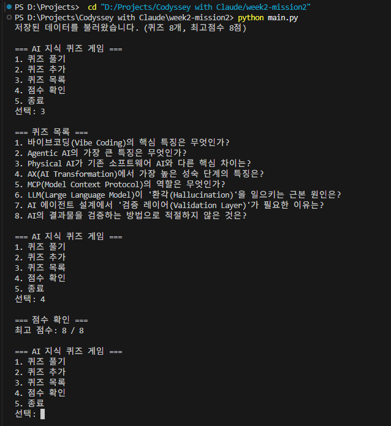

# AI 지식 퀴즈 게임

> **원격 저장소**: [Marina2nd_Codyssey](https://github.com/MylovelyCatMori/Marina2nd_Codyssey) / `week2-mission2/`

## 프로젝트 개요

터미널에서 동작하는 AI 주제 퀴즈 게임입니다.
바이브코딩, Physical AI, AI Transformation, Agentic AI 등 현재 AI 트렌드를 주제로 한 퀴즈를 풀고, 등록하고, 점수를 관리합니다.
Python 기본 문법과 클래스 설계, JSON 파일 입출력, Git 버전 관리를 학습하는 Codyssey Mission2 과제입니다.

## 퀴즈 주제 선정 이유

생산 현장에서 AI 전환(AX)을 직접 목격하면서, AI 관련 핵심 개념을 체계적으로 정리할 필요성을 느꼈습니다.
단순한 퀴즈가 아니라, 스스로 공부한 내용을 문제화하여 기억에 남기는 학습 도구로 활용합니다.

주제 목록: 바이브코딩, Agentic AI, Physical AI, AX(AI Transformation), MCP, LLM 환각, 검증 레이어

## 실행 방법

```bash
python main.py
```

Python 3.10 이상 필요. 외부 라이브러리 없음 (표준 라이브러리만 사용).

## 기능 목록

| 번호 | 기능 | 설명 |
|------|------|------|
| 1 | 퀴즈 풀기 | 저장된 퀴즈를 순서대로 풀고 점수 확인 |
| 2 | 퀴즈 추가 | 새로운 퀴즈를 등록하고 저장 |
| 3 | 퀴즈 목록 | 등록된 모든 퀴즈 문제 목록 확인 |
| 4 | 점수 확인 | 최고 점수 조회 |
| 5 | 종료 | 데이터 저장 후 프로그램 종료 |

## 파일 구조

```
week2-mission2/
├── main.py            # 메인 프로그램 (Quiz, QuizGame 클래스 포함)
├── state.json         # 퀴즈 데이터 및 최고 점수 저장 파일 (실행 시 자동 생성)
├── README.md          # 프로젝트 문서
├── STEPS.md           # 단계별 구현 가이드
├── STUDY_GUIDE.md     # 동료평가 대비 학습 가이드
├── .gitattributes     # LF 강제 (Windows/Mac 호환)
├── .gitignore         # Python 빌드 파일 제외
└── docs/
    └── screenshots/   # 실행 화면 스크린샷
        ├── manu.png         # 메뉴 화면
        ├── play1.png        # 퀴즈 풀기 1
        ├── play2.png        # 퀴즈 풀기 2
        ├── add quiz.png     # 퀴즈 추가 1
        ├── add quiz2.png    # 퀴즈 추가 2
        ├── add quiz3.png    # 퀴즈 추가 3
        ├── score.png        # 점수 확인
        ├── exit.png         # 종료
        ├── restart.png      # 재실행 시 데이터 유지 확인
        ├── git config.png   # Git 설정 확인
        └── git log.png      # Git 커밋 이력
```

## 데이터 파일 설명 (state.json)

- **경로**: `week2-mission2/state.json` (main.py 기준 동일 디렉토리)
- **역할**: 퀴즈 데이터와 최고 점수를 프로그램 종료 후에도 유지 (데이터 영속성)
- **인코딩**: UTF-8
- **스키마**:

```json
{
    "quizzes": [
        {
            "question": "문제 텍스트",
            "choices": ["선택지1", "선택지2", "선택지3", "선택지4"],
            "answer": 1
        }
    ],
    "best_score": 0
}
```

| 필드 | 타입 | 설명 |
|------|------|------|
| `quizzes` | list | 퀴즈 객체 배열 |
| `quizzes[].question` | str | 문제 텍스트 |
| `quizzes[].choices` | list[str] | 선택지 4개 |
| `quizzes[].answer` | int | 정답 번호 (1~4) |
| `best_score` | int | 역대 최고 정답 수 |

## 코드 구조와 설계 의도

### 클래스 구조

이 프로그램은 2개의 클래스로 역할을 분리하여 설계하였습니다.

| 클래스 | 역할 | 속성 | 메서드 |
|--------|------|------|--------|
| `Quiz` | 퀴즈 **1개**를 표현 | `question`(str), `choices`(list), `answer`(int) | `display()`, `check_answer()`, `to_dict()`, `from_dict()` |
| `QuizGame` | 게임 **전체** 관리 | `quizzes`(list), `best_score`(int) | `run()`, `play()`, `add_quiz()`, `show_list()`, `show_score()`, `load_state()`, `save_state()` |

### 왜 2개의 클래스로 나누었는가?

- **Quiz**: "나는 문제 하나다. 나를 보여주고(`display`), 정답을 확인해 줄 수 있다(`check_answer`)."
- **QuizGame**: "나는 게임 진행자다. 여러 퀴즈를 관리하고, 점수를 기록하고, 파일에 저장한다."
- 퀴즈가 100개가 되어도 Quiz 클래스 코드는 바뀌지 않습니다.
- 게임 규칙이 바뀌어도 Quiz 클래스는 영향받지 않습니다.
- 각 클래스가 **하나의 역할만 담당**하므로, 수정할 때 어디를 고쳐야 하는지 명확합니다.

### 주요 설계 결정

| 결정 | 이유 |
|------|------|
| `get_int_input()` 메서드 분리 | 메뉴 선택(1~5), 정답 입력(1~4), 퀴즈 추가 시 정답 번호 입력 등 "정수 입력 검증"이 3곳에서 반복되므로 한 번 정의하고 재사용 |
| `to_dict()` / `from_dict()` 쌍 | Quiz 객체는 JSON으로 직접 저장할 수 없으므로, dict로 변환(직렬화)하는 메서드와 dict에서 복원하는 메서드를 쌍으로 구현 |
| `_load_defaults()` 밑줄 접두사 | 클래스 내부에서만 사용하는 메서드라는 관례적 표기. 외부에서 직접 호출하지 않는다는 신호 |
| `STATE_FILE` 절대경로 | `os.path.abspath(__file__)` 기준으로 경로를 구성하여, 어떤 디렉토리에서 실행해도 state.json이 main.py와 같은 폴더에 생성됨 |

---

## 핵심 개념 정리

> 과제 목표: "이 과제를 마친 후, 학습자는 아래를 스스로 설명할 수 있어야 한다."

### Python 기초

| 개념 | 설명 | 코드 위치 예시 |
|------|------|----------------|
| **변수** | 값에 이름표를 붙여 메모리에 저장하고 재사용하는 것 | `score = 0`, `total = len(self.quizzes)` |
| **int, str, bool, list, dict 차이** | int=정수, str=문자열, bool=참/거짓, list=순서 있는 목록, dict=키-값 쌍 | `answer`(int), `question`(str), `check_answer` 반환값(bool), `choices`(list), `DEFAULT_QUIZZES` 내 각 항목(dict) |
| **if/elif/else** | 조건에 따라 다른 동작을 수행 | `run()`의 메뉴 분기: `if choice == 1: self.play()` |
| **for vs while** | for=정해진 횟수 반복, while=조건 충족까지 반복 | for: `play()`의 퀴즈 출제 루프 / while: `get_int_input()`의 입력 검증 루프 |
| **함수(매개변수, 반환값)** | 반복 작업을 묶어 이름 붙이고 재사용. 입력(매개변수)을 받아 결과(반환값)를 돌려줌 | `get_int_input(prompt, min_val, max_val)` -> `return value` |

### 클래스와 객체

| 개념 | 설명 | 코드 위치 예시 |
|------|------|----------------|
| **클래스** | 관련된 데이터(속성)와 기능(메서드)을 묶은 설계도. 비유: 붕어빵 틀 | `class Quiz:`, `class QuizGame:` |
| **객체** | 클래스(틀)로 만든 실제 인스턴스. 비유: 틀로 찍은 붕어빵 | `Quiz("문제", [...], 2)`, `QuizGame()` |
| **`__init__`** | 객체 생성 시 자동 호출되는 초기화 메서드. 속성에 초기값을 설정 | `def __init__(self, question, choices, answer):` |
| **`self`** | "이 객체 자신"을 가리키는 참조. 모든 메서드의 첫 매개변수 | `self.question = question` (이 퀴즈의 문제에 값을 저장) |
| **속성과 메서드** | 속성=객체가 가진 데이터, 메서드=객체가 할 수 있는 행동 | 속성: `self.best_score` / 메서드: `self.play()` |

### 파일 입출력

| 개념 | 설명 | 코드 위치 예시 |
|------|------|----------------|
| **파일 열기/읽기/쓰기** | `open()` -> 읽기(`"r"`) 또는 쓰기(`"w"`) -> `with`문으로 자동 닫기 | `with open(STATE_FILE, "r", encoding="utf-8") as f:` |
| **JSON** | JavaScript Object Notation. 사람이 읽을 수 있는 텍스트 기반 데이터 형식. Python dict/list와 구조가 거의 같음 | `json.load(f)` = 파일->dict, `json.dump(data, f)` = dict->파일 |
| **try/except** | 오류가 발생할 수 있는 코드를 시도하고, 실패 시 대비책을 실행 | `try: json.load(f)` / `except json.JSONDecodeError: self._load_defaults()` |
| **데이터 영속성** | 프로그램 종료 후에도 데이터가 유지되는 성질. 변수(메모리)는 종료 시 사라지지만, 파일(디스크)은 남아있음 | `save_state()` = 메모리->디스크, `load_state()` = 디스크->메모리 |

### Git 기초

| 개념 | 설명 |
|------|------|
| **Git** | 코드의 변경 이력을 기록하는 버전 관리 도구. 비유: 변경 내용만 기록하는 타임머신 |
| **원격 저장소** | GitHub에 있는 저장소. 로컬 작업을 push로 업로드하고, pull로 다운로드 |
| **브랜치** | 메인 코드에 영향 없이 별도 공간에서 작업. 완료 후 merge로 합침 |
| **커밋 메시지 컨벤션** | `Feat:` 새 기능, `Fix:` 버그 수정, `Docs:` 문서, `Refactor:` 코드 정리 |

---

## 예외 및 에러 처리

| 상황 | 처리 방법 | 코드 위치 |
|------|-----------|-----------|
| 빈 입력 (그냥 Enter) | `"입력이 없습니다"` 안내 후 재입력 | `get_int_input()` - `if not raw:` |
| 숫자가 아닌 입력 (abc) | `"숫자만 입력해 주세요"` 안내 후 재입력 | `get_int_input()` - `except ValueError:` |
| 범위 밖 숫자 (0, 9 등) | `"1~5 범위의 숫자를 입력해 주세요"` 안내 후 재입력 | `get_int_input()` - `if not (min_val <= value <= max_val):` |
| Ctrl+C 강제 종료 | 데이터 저장 후 안전하게 종료 | `run()` - `except (KeyboardInterrupt, EOFError):` |
| state.json 파일 없음 | 기본 퀴즈 7개로 자동 시작 | `load_state()` - `if not os.path.exists(STATE_FILE):` |
| state.json 파일 손상 | `"저장 파일이 손상되었습니다"` 안내 후 기본 데이터로 복구 | `load_state()` - `except json.JSONDecodeError:` |
| 퀴즈 없는 상태에서 풀기 시도 | `"등록된 퀴즈가 없습니다"` 안내 후 메뉴로 복귀 | `play()` - `if not self.quizzes:` |
| 퀴즈 추가 시 빈 문제 입력 | `"문제를 입력하지 않아 취소합니다"` 안내 후 메뉴로 복귀 | `add_quiz()` - `if not question:` |
| 퀴즈 추가 시 빈 선택지 입력 | `"선택지를 입력해 주세요"` 안내 후 재입력 | `add_quiz()` - `if choice:` 검증 루프 |

---


## 실행 화면

### 메뉴 화면


### 퀴즈 풀기


### 퀴즈 추가


### 점수 확인


### 종료


### 재실행 시 데이터 저장 확인


## 개발 환경

### Git 설정


### Git 커밋 이력


## Git 사용 기록

### 필수 명령어 7종 사용 내역

| 명령어 | 사용 위치 | 설명 |
|--------|-----------|------|
| `git init` | Mission1에서 수행 (단일 레포 전략) | 현재 폴더를 Git 저장소로 초기화 |
| `git add` | 모든 STEP | 변경 파일을 스테이징 영역에 올림 |
| `git commit` | 모든 STEP (15개+) | 스테이징된 변경사항을 확정 기록 |
| `git push` | STEP 5, 9, 10 | 로컬 커밋을 GitHub에 업로드 |
| `git pull` | STEP 10 | 원격 변경사항을 로컬로 가져옴 |
| `git checkout` | STEP 5 | `feature/play` 브랜치 생성 및 전환 |
| `git clone` | STEP 10 | 원격 저장소를 별도 디렉토리에 복제 |

### 브랜치 전략

STEP 5에서 퀴즈 풀기 기능을 `feature/play` 브랜치로 분리해 개발한 뒤 master에 병합했다.
**이 병합은 Fast-forward(FF) 방식으로 진행되었다.**

```
[1] 브랜치 생성 - git checkout -b feature/play
                        master
                          ↓
    ... --- af3be39 --- 0883b3c
                          ↑
                     feature/play        (같은 커밋을 가리킴)

[2] 기능 개발 - feature/play에서 커밋
                        master
                          ↓
    ... --- af3be39 --- 0883b3c --- 5d5d369  "Feat: 퀴즈 풀기 기능 구현"
                                       ↑
                                  feature/play

[3] git checkout master && git merge feature/play  →  Fast-forward
                                    master, feature/play
                                              ↓
    ... --- af3be39 --- 0883b3c --- 5d5d369 --- 5a7728a --- ...
```

- `git checkout -b feature/play`: STEP 5에서 퀴즈 풀기 기능 개발용 브랜치 생성 (0883b3c에서 분기)
- `git merge feature/play`: 기능 완성 후 master에 병합, Fast-forward로 처리됨
- **왜 브랜치를 사용하는가?**: 새 기능 개발 도중 버그가 생겨도 master는 안전하게 유지됨

#### Fast-forward와 3-way merge의 차이

**Fast-forward**: 분기한 뒤 master가 한 발짝도 움직이지 않은 경우. 합칠 것이 없으므로
Git은 새 커밋을 만들지 않고 **master 포인터만 앞으로 밀어준다**.

```
[병합 전]                        [병합 후 - FF]

master                                        master, feature
  ↓                                                  ↓
 C4 --- C5(feature)              C3 --- C4 ------- C5
  |                                     
 C3                              새 커밋 없음. 포인터만 이동.
```

**3-way merge**: 분기한 뒤 **양쪽 모두 커밋이 쌓인** 경우. 두 갈래를 합칠 방법이 없으므로
Git은 **부모가 2개인 머지 커밋을 새로 만든다**.

```
[병합 전]                        [병합 후 - merge commit]

     C5a (내 쪽)                      C5a ---┐
    /                                /        \
  C4                              C4          M   ← 부모 2개
    \                                \        /
     C5b (상대 쪽)                    C5b ---┘
```

**우리가 STEP 5에서 한 것은 FF다.** `feature/play`로 분기한 뒤 master에 아무 커밋도
추가하지 않았기 때문이다. 그래서 `git log --graph`를 봐도 갈래가 보이지 않고
직선으로 나온다. 갈래가 없는 것이 아니라, FF가 갈래를 남기지 않는 방식이기 때문이다.

브랜치를 실제로 썼다는 증거는 reflog에 남아 있다.

```
$ git reflog show feature/play
5d5d369 feature/play@{0}: commit: Feat: 퀴즈 풀기 기능 구현 ...
0883b3c feature/play@{1}: branch: Created from HEAD
```

#### 이 저장소에 실제로 남은 3-way merge 사례

STEP 10 진행 중, GitHub 웹에서 README를 수정하는 동안 로컬에서도 커밋을 만들어
로컬 master와 원격 master가 갈라졌다. `git pull`이 이를 자동으로 3-way merge 했다.

```
                 ┌── 9302138  (로컬 커밋: 스크린샷 추가) ───┐
                 │                                          │
    2183b83 ─────┤                                          ├──→ 282c532  (merge commit)
                 │                                          │
                 └── ff25306  (GitHub 웹 커밋: README 수정) ─┘
```

```
$ git log -1 --format='%h  parents: %p' 282c532
282c532  parents: 9302138 ff25306
```

부모가 2개다. 위의 FF 병합(5d5d369)은 부모가 1개뿐이다. 같은 "merge"라도
양쪽에 커밋이 쌓였는지 아닌지에 따라 결과 모양이 이렇게 달라진다.

### 커밋 메시지 컨벤션

| 접두사 | 의미 | 예시 |
|--------|------|------|
| `Feat:` | 새 기능 추가 | `Feat: Quiz 클래스 구현` |
| `Fix:` | 버그 수정 | `Fix: state.json 경로를 main.py 기준으로 변경` |
| `Docs:` | 문서 작성/수정 | `Docs: README 완성 및 스크린샷 추가` |
| `Chore:` | 설정/운영 관련 | `Chore: Mission2 초기 세팅` |

### Git 커밋 이력 (텍스트)

```
* 747b321 Update README.md
* 43f6074 Update README.md
* 4e4ca0b Update images in README.md
* d5acdae Update README with error handling descriptions
* b9964ad Enhance README with images and quiz instructions
* e7385bd Docs: README 대원칙 수립 및 Mission2 README 전면 보강
* 568a713 Docs: README 요구사항 재검증 및 재배열
* cffdf97 Docs: git config, git log 스크린샷 README에 추가
* 6cfd1d8 Docs: 재실행 데이터 유지 스크린샷 README에 추가
* 036bb18 Docs: Clone/Pull 실습 기록 상세 작성
*   282c532 Merge branch 'master'
|\
| * ff25306 Remove quiz topic selection rationale from README
* | 9302138 Docs: 재실행 데이터 유지 스크린샷 추가 + main.py 상세 학습 주석
|/
* 2183b83 Docs: 개발 환경 스크린샷 추가 (git config)
* d62074c Docs: git log 스크린샷 추가 및 TODO 업데이트
* 53e7260 Docs: clone/pull 실습용 변경
* c66e725 Docs: README 완성 및 실행 화면 스크린샷 8장 추가
* 5b57b7c Fix: state.json 경로를 main.py 기준으로 변경
* a6deaed Feat: 점수 확인 기능 구현 (최고 점수 표시)
* 25ce41f Feat: 퀴즈 목록 기능 구현
* 5a7728a Feat: 퀴즈 추가 기능 구현 및 state.json 자동 저장
* 5d5d369 Feat: 퀴즈 풀기 기능 구현 (정답 확인/결과 표시/최고점수 갱신)
* 0883b3c Feat: 메뉴 기능 및 공통 입력/예외 처리 구현
```

---

## 요구변경 시 수정 위치 가이드

코드 구조를 이해하면 "어디를 고쳐야 하는가?"를 빠르게 판단할 수 있습니다.

| 변경 요구 | 수정 위치 | 이유 |
|-----------|-----------|------|
| 점수 계산 방식 변경 (가중치 등) | `QuizGame.play()` 내 `score += 1` 부분 | 점수 산출 로직이 이 메서드에 집중 |
| 퀴즈 필드 추가 (난이도, 카테고리) | `Quiz.__init__()`, `to_dict()`, `from_dict()` | 퀴즈 데이터 구조를 정의하는 3곳을 함께 수정 |
| 선택지 개수 변경 (4개 -> 5개) | `QuizGame.add_quiz()` 내 `range(4)` + `Quiz.display()` | 선택지 입력과 출력 두 곳 |
| 저장 형식 변경 (JSON -> DB) | `load_state()`, `save_state()` | 데이터 입출력이 이 두 메서드에 캡슐화됨 |
| 메뉴 항목 추가 | `show_menu()` + `run()` 내 분기문 | 메뉴 출력과 선택 처리 두 곳 |

---

## 확장성과 데이터 보호에 대한 고려

### 대규모 확장 시 (예: 퀴즈 1000개)

현재 구조는 `state.json` 하나에 모든 퀴즈를 저장합니다. 퀴즈가 1000개 이상으로 늘어날 경우:
- **메모리**: 프로그램 시작 시 전체 퀴즈를 메모리에 로드하므로, 수천 개 수준에서는 문제없지만 수만 개부터는 부분 로딩이 필요합니다.
- **검색**: 현재 순차 탐색이므로, 대량 데이터에서는 카테고리별 분류나 인덱싱이 필요합니다.
- **저장**: JSON 파일 전체를 매번 덮어쓰므로, 대량 데이터에서는 SQLite 등 DB로 전환하는 것이 적합합니다.

이 과제는 Python 기초 학습이 목적이므로, 현재 구조가 적합합니다.

### 데이터 백업 개념

현재 `state.json` 손상 시 기본 퀴즈로 자동 복구됩니다. 실무에서는 추가로:
- **임시파일 쓰기 후 교체**: `state.tmp`에 먼저 쓰고, 성공 시 `state.json`으로 이름 변경 (원자적 교체)
- **롤링 백업**: 저장 시 이전 파일을 `state.json.bak`으로 복사 후 새로 저장

이러한 전략은 파일 쓰기 도중 오류가 발생해도 이전 데이터를 보존할 수 있게 합니다.

### Clone/Pull 실습 기록

```bash
# 1. 별도 디렉토리에 저장소 복제 (clone)
#    clone = 원격 저장소의 전체 이력을 포함한 완전한 사본을 만드는 명령어
git clone https://github.com/MylovelyCatMori/Marina2nd_Codyssey.git D:/Projects/Marina2nd_Codyssey-clone

# 2. 복제된 저장소에서 README 수정 후 commit + push
cd D:/Projects/Marina2nd_Codyssey-clone
git add week2-mission2/README.md    # 변경 파일을 스테이징
git commit -m "Docs: clone/pull 실습용 변경"  # 변경사항 확정
git push origin master              # GitHub에 업로드

# 3. 원래 작업 디렉토리에서 변경사항 가져오기 (pull)
#    pull = 원격 저장소의 새로운 커밋을 로컬에 가져와 병합하는 명령어
#    clone과의 차이: clone은 "처음 복사", pull은 "이미 있는 저장소를 최신으로 갱신"
cd "D:/Projects/Codyssey with Claude"
git pull origin master
# -> Fast-forward 병합으로 변경사항 정상 반영 확인
```
