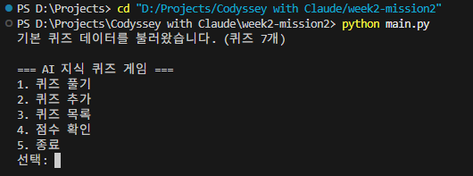
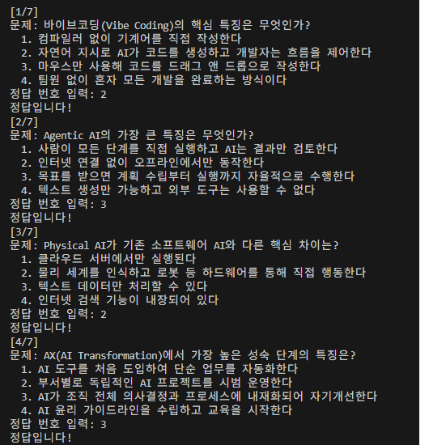
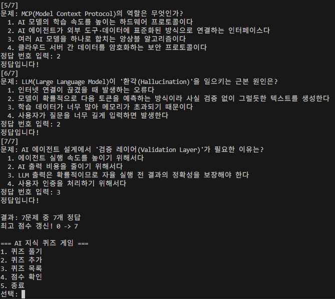
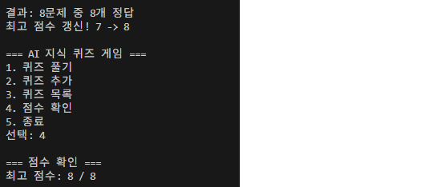
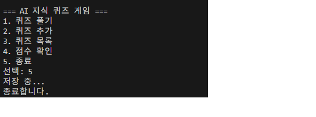

# AI 지식 퀴즈 게임

## 프로젝트 개요

터미널에서 동작하는 AI 주제 퀴즈 게임입니다.
바이브코딩, Physical AI, AI Transformation, Agentic AI 등 현재 AI 트렌드를 주제로 한 퀴즈를 풀고, 등록하고, 점수를 관리합니다.
Python 기본 문법과 클래스 설계, JSON 파일 입출력, Git 버전 관리를 학습하는 Codyssey Mission2 과제입니다.

## 퀴즈 주제 선정 이유

제약 생산 현장에서 AI 전환(AX)을 직접 목격하면서, AI 관련 핵심 개념을 체계적으로 정리할 필요성을 느꼈습니다.
단순한 퀴즈가 아니라, 스스로 공부한 내용을 문제화하여 기억에 남기는 학습 도구로 활용합니다.

## 실행 방법

```bash
python main.py
```

Python 3.10 이상 필요. 외부 라이브러리 없음 (표준 라이브러리만 사용).

## 기능 목록

| 번호 | 기능 | 설명 |
|------|------|------|
| 1 | 퀴즈 풀기 | 저장된 퀴즈를 순서대로 풀고 점수 확인 |
| 2 | 퀴즈 추가 | 새로운 퀴즈를 등록하고 저장 |
| 3 | 퀴즈 목록 | 등록된 모든 퀴즈 문제 목록 확인 |
| 4 | 점수 확인 | 최고 점수 조회 |
| 5 | 종료 | 프로그램 종료 |

## 파일 구조

```
week2-mission2/
├── main.py          # 메인 프로그램 (Quiz, QuizGame 클래스 포함)
├── state.json       # 퀴즈 데이터 및 최고 점수 저장 파일
├── README.md        # 프로젝트 문서
├── .gitattributes   # LF 강제 (Windows/Mac 호환)
├── .gitignore       # Python 빌드 파일 제외
├── STUDY_GUIDE.md   # 동료평가 대비 학습 가이드
└── docs/
    └── screenshots/ # 실행 화면 스크린샷
        ├── manu.png
        ├── play1.png
        ├── play2.png
        ├── add quiz.png
        ├── add quiz2.png
        ├── add quiz3.png
        ├── score.png
        └── exit.png
```

## 데이터 파일 설명 (state.json)

- **경로**: `week2-mission2/state.json` (main.py 실행 위치 기준)
- **역할**: 퀴즈 데이터와 최고 점수를 프로그램 종료 후에도 유지
- **인코딩**: UTF-8
- **스키마**:

```json
{
    "quizzes": [
        {
            "question": "문제 텍스트",
            "choices": ["선택지1", "선택지2", "선택지3", "선택지4"],
            "answer": 1
        }
    ],
    "best_score": 0
}
```

| 필드 | 타입 | 설명 |
|------|------|------|
| `quizzes` | list | 퀴즈 객체 배열 |
| `quizzes[].question` | str | 문제 텍스트 |
| `quizzes[].choices` | list[str] | 선택지 4개 |
| `quizzes[].answer` | int | 정답 번호 (1~4) |
| `best_score` | int | 역대 최고 정답 수 |

## 실행 화면

### 메뉴 화면


### 퀴즈 풀기



### 퀴즈 추가


### 점수 확인


### 종료

